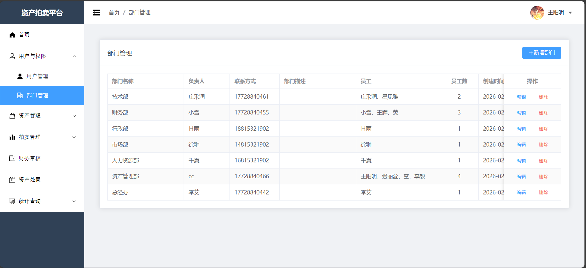
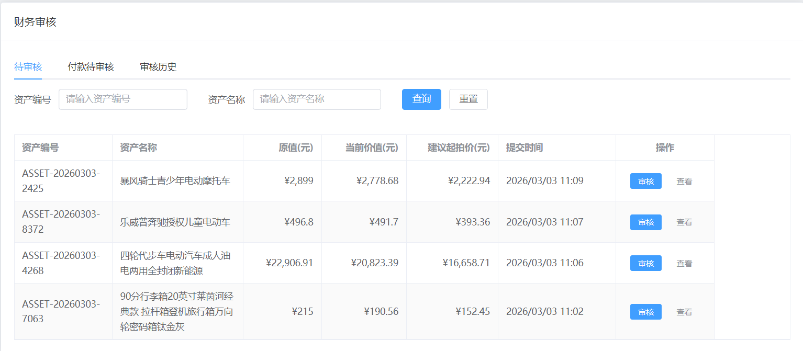
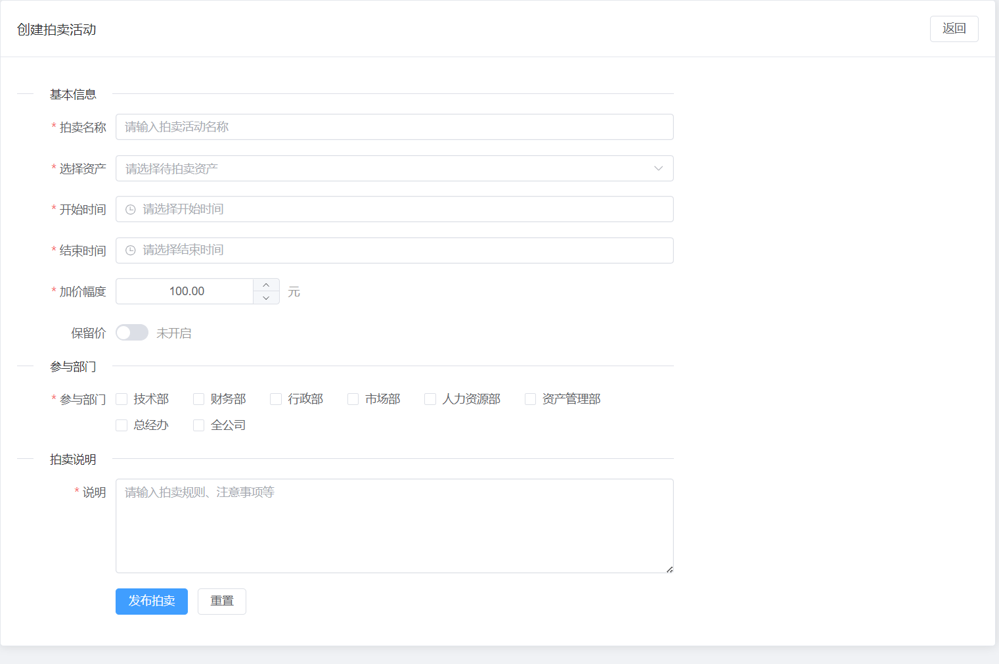
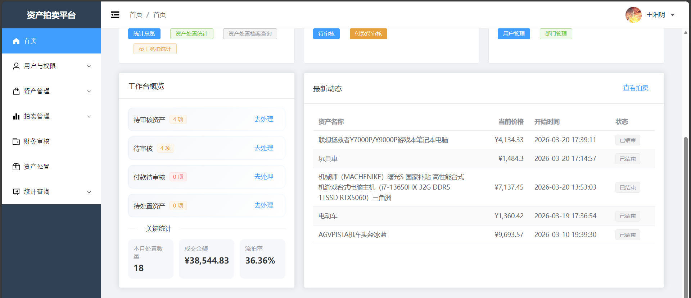
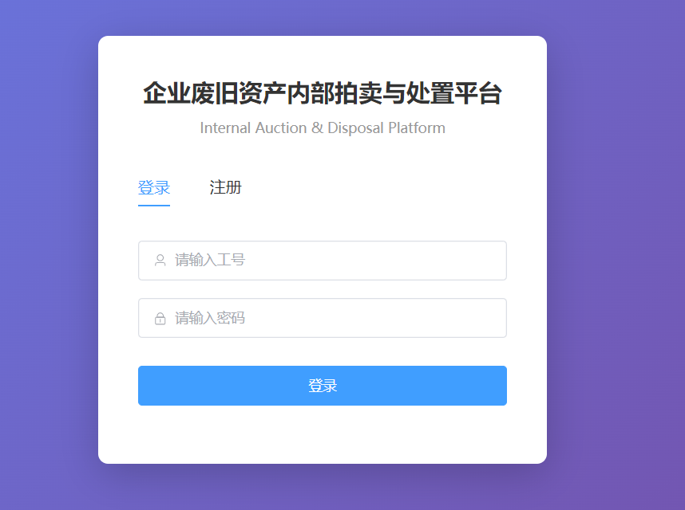
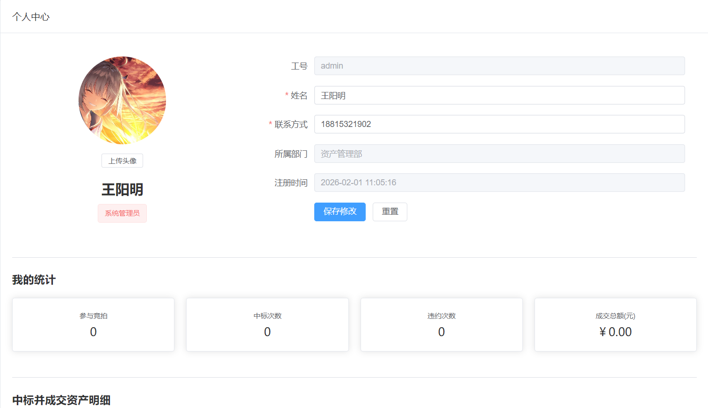
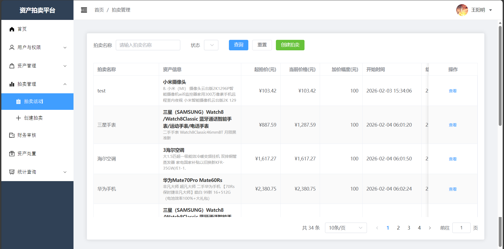
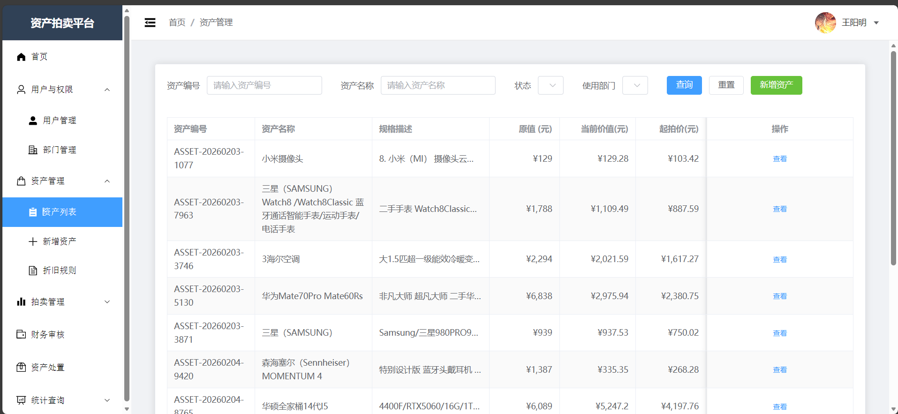
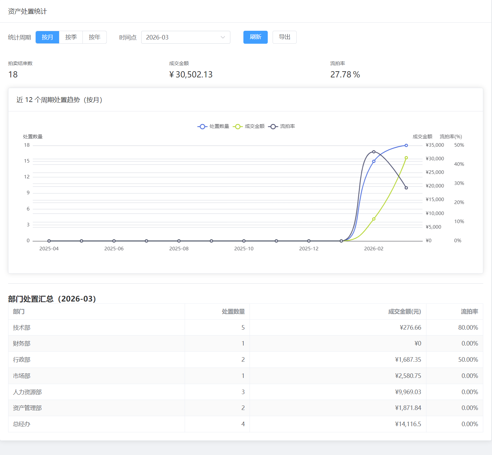

# 企业废旧资产内部拍卖与处置平台（WAIDP）

本项目为“企业废旧资产内部拍卖与处置平台”毕业设计，实现资产定价审核、内部拍卖、成交确认、交易单审核与资产处置归档等流程。

## 技术栈

- 后端：Spring Boot 3.x、Spring Security、Spring Data JPA、MySQL、JWT
- 前端：Vue 3、Vite、Element Plus

## 运行前准备

1. 安装环境

   - JDK 17
   - Maven 3.8+
   - Node.js 18+（建议 18/20 LTS）
   - MySQL 8.x
2. 准备数据库

   - 创建数据库：`waidp_springboot_master`
   - 初始化表结构与基础数据：
     - 如果你有项目对应的 SQL 初始化脚本，请先导入；
     - 本项目当前 `backend/src/main/resources/application.yml` 默认 `spring.jpa.hibernate.ddl-auto: none`，不会自动建表。

## 配置说明（重要）

出于安全考虑，仓库默认忽略 `backend/src/main/resources/application.yml`（避免把数据库密码提交到 GitHub）。

请按以下方式创建本地配置：

1. 复制示例文件：
   - `backend/src/main/resources/application.yml.example` → `backend/src/main/resources/application.yml`
2. 按你的本机环境修改：
   - `spring.datasource.url/username/password`
   - `server.port`（默认 `8084`）
   - `upload.path`、`file.upload-dir`（建议使用相对路径或你本机可写目录）

## 一键启动（Windows）

仓库根目录提供脚本：`start_project_with_check.bat`

- 双击或在命令行运行：`start_project_with_check.bat`
- 脚本会尝试清理端口占用，然后启动：
  - 后端：`http://localhost:8084`
  - 前端：`http://localhost:5173`

## 手动启动

### 1) 启动后端

```bash
cd backend
mvn spring-boot:run
```

### 2) 启动前端

```bash
cd frontend
npm install
npm run dev
```

前端代理在 `frontend/vite.config.js` 中配置，默认转发 `/api` 到 `http://localhost:8084`。

如需切换后端端口，可通过环境变量：

```bash
cd frontend
set VITE_BACKEND_PORT=8084
npm run dev
```

## 默认账号

后端启动后会自动初始化系统管理员账号（若不存在）：

- 用户名：`admin`
- 密码：`admin123`

初始化逻辑见：`backend/src/main/java/com/waidp/config/DataInitializer.java`

## 业务流程（对应 毕设需求.txt）

- 资产创建 → 自动定价 → 状态“待审核”
- 财务审核通过（可设置保留价）→ 状态“待拍卖”
- 资产专员创建拍卖活动并发布
- 员工出价：结束前 5 分钟内出价自动延长 5 分钟
- 拍卖结束：
  - 若最高价达到保留价（或未启用保留价）→ 产生中标者，生成待确认的交易单
  - 否则 → 流拍，资产回到“待拍卖”
- 中标者需在 24 小时内确认成交；超时视为放弃并触发惩罚（3 个月竞拍禁用）

## 常见问题

1) 前端能打开但接口 404/500？

- 检查后端是否已启动、端口是否一致；
- 检查 `frontend/vite.config.js` 的代理端口；
- 检查 `backend/src/main/resources/application.yml` 的数据库连接是否正确。

2) 数据库没有表导致启动报错？

- 需要导入项目初始化 SQL（推荐），或临时把 `ddl-auto` 改为 `update/create` 让 JPA 自动建表（不建议用于生产/最终提交）。

## License

毕业设计用途学习项目。
## 系统功能页面展示

### 部门管理


### 财务审核


### 创建拍卖活动


### 管理员首页


### 登录页面


### 个人中心


### 拍卖活动页面


### 资产管理页面


### 资产统计页面


